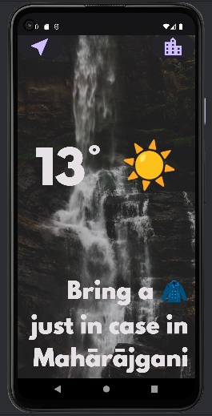
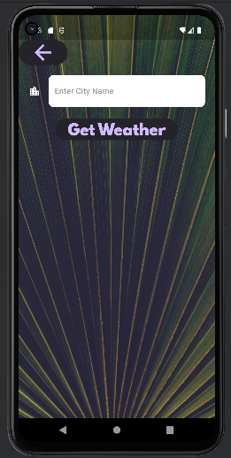

# Weather App

A simple Flutter weather app that provides current weather information based on user location or city input.

## Features

- **Location-based Weather:** Get real-time weather information based on your current location.
- **City-specific Weather:** Enter the name of any city to retrieve its current weather details.
- **Responsive Design:** The app adjusts to different screen sizes, ensuring a seamless user experience.

## Screenshots



*Caption: Location Screen: "Instant Weather Updates: The location-based screen provides real-time weather details for your current surroundings. With a glance, stay informed about temperature, conditions, and more."*



*Caption: City Screen: "Explore Any City: Enter the name of a city to discover its current weather conditions. The interactive icons make it easy to visualize the forecast for your chosen destination."*

## Getting Started

To run this app locally, follow these steps:

1. Clone this repository:

   ```bash
   git clone https://github.com/your-username/weather-app.git
2. Navigate to the project directory:
    ```bash
   cd weather-app

3. Install dependencies:
    ```bash
    flutter pub get
4. Run the app:
    ```bash
   flutter run

## Dependencies
This project uses the following Flutter packages:
- flutter_spinkit: A collection of loading indicators for Flutter.
- geolocator: It provides easy access to the device's location, making it suitable for location-based applications.
- http: A package for making HTTP requests. It simplifies the process of sending HTTP requests and handling responses.
- flutter_dotenv: A package for loading environment variables from a .env file in a Flutter project.

## Weather API
The app uses the OpenWeatherMap API to fetch weather data. You'll need to replace the apiKey in the WeatherModel class with your own API key. Sign up for an API key at OpenWeatherMap.

## Contributing
If you'd like to contribute to the development of the BMI Calculator app, feel free to:

- Submit pull requests
- Open issues on the GitHub repository

## License
This project is licensed under the MIT License. See the [LICENSE](https://opensource.org/licenses/MIT) file for details.

## Contact
For any questions or feedback, please contact the project maintainer at kshubham767@gmail.com.
